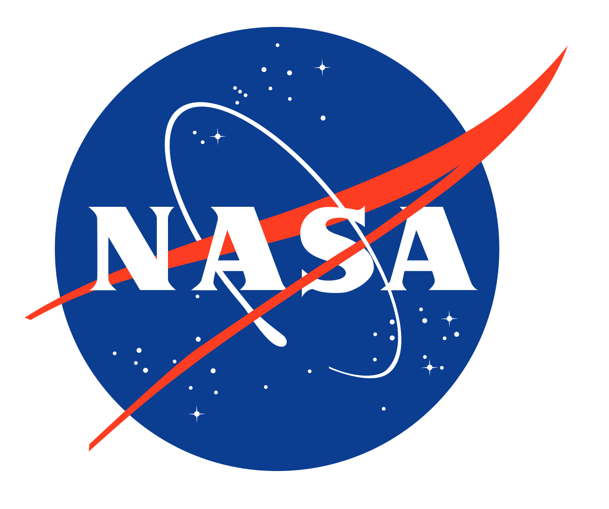
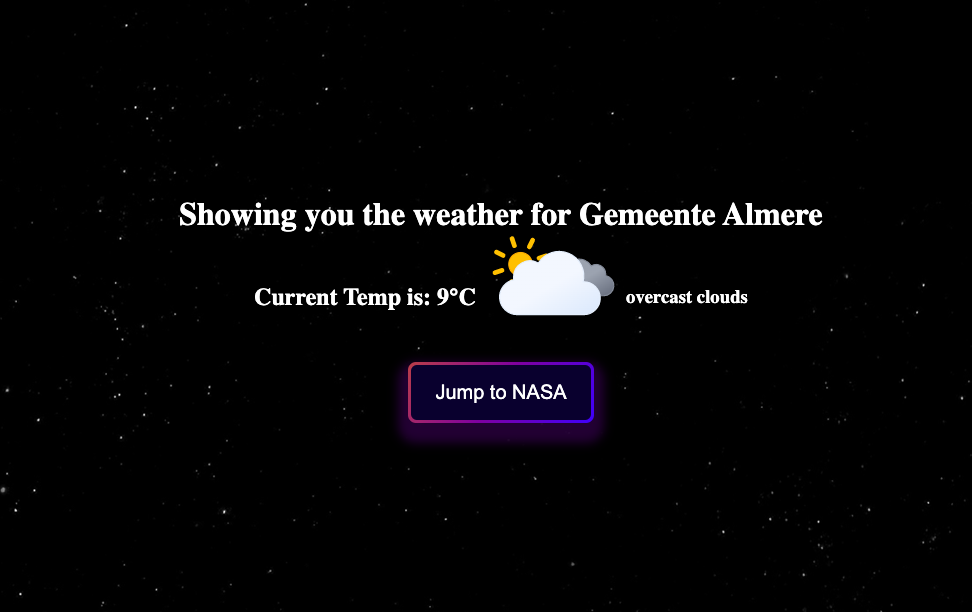

# NASA & Weather APIs Project

<!-- PROJECT LOGO -->
 

  
  

## About the Project
I designed this web app for my project during the Using APIs module at HackYourFuture journey of learning web development. 
The web version of this project can be seen [here](https://nidaulzafar.github.io/api-project/).

The app fetches data from three sources.
* First of all, if allowed by the user, the app will access the user's location and fetch the weather data for the user from openweathermap. 
* Secondly, it fetches the Picture of the Day from NASA's Astronomy Picture of the Day API. 
* Lastly, we can access NASA's database for images related to any search word the user may have. Including videos in the search result is optional.

Foreseeable errors like location access denied, failing to fetch data and unavailable data are handled such that the user can see on the screen what went wrong.

### Built With

The app was built using the knowledge gained by studying different modules of HTML HackYourFuture curriculum especially:

  
  
 
 

## Roadmap

- [x] Responsive app
- [x] Use atleast one API to fetch data
- [x] Loading/error handling for the interaction with the API
- [ ] Fetch the forecast
- [ ] Additional Options
    - [ ] Add option to get weather for any location
    - [ ] Utilise the Get Details button to fetch more details about the search results

## Contributing

This is in no way a perfect application. I am in the process of learning and implementing knowledge. Therefore, contributions, suggestions and feedbacks are **heartily welcome**. If you have a suggestion that would make this better, please fork the repo and create a pull request. You can also simply open an issue with the tag "enhancement".
Don't forget to give the project a star! Thanks again!

1. Fork the Project
2. Create your Feature Branch (`git checkout -b feature/AmazingFeature`)
3. Commit your Changes (`git commit -m 'Add some AmazingFeature'`)
4. Push to the Branch (`git push origin feature/AmazingFeature`)
5. Open a Pull Request

## Contact

Nida ul Zafar  
 

## Acknowledgments

I would like to express my deepest appreciation to a number of people and resources that helped me get through this project. 

* [Martijn](https://plebian.nl/) My mentor for this project who not only guided me with the project but also on the principles of development.
* [Rob van Kruijsdijk](https://github.com/robvk) For helping me out with the bugs.
* [Abdullah](https://github.com/abbathaw) My homework mentor who explained me patiently the concepts of try / catch and async / await.
* [OpenWeather](https://openweathermap.org/about-us) For their informative and easy to handle API that I used in this project.
* [NASA](https://www.nasa.gov/) For their APIs to display an astonishing Picture of the Day and the Image database.
* [Carla Codes](https://github.com/Carla-Codes) For the wonderful stars twinkling animation I have used for the background.
* [GetCSSScans](https://getcssscan.com/css-buttons-examples) For the beautiful button design.
* [Alvaro](https://alvarotrigo.com/blog/css-checkbox-styles/) For the cool checkbox button.
* [Othneil Drew](https://github.com/othneildrew) For his carefully designed readme template that helped me design mine.
* [Shields](https://shields.io/) For their easy to design badges that I have used above.
* Last but not least the [HackYourFuture Team](https://github.com/HackYourFuture) for their untiring guidance and efforts.
